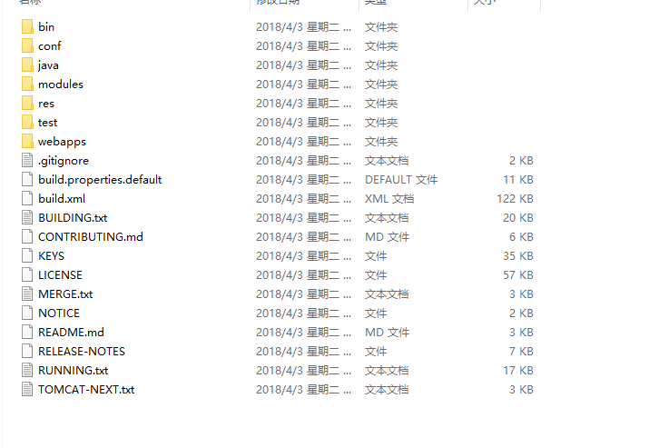
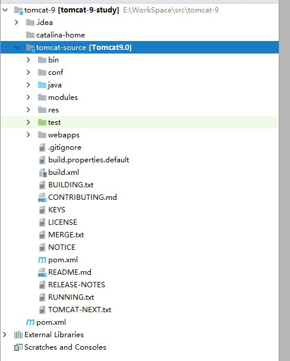

# 源码运行环境

###### 在 IntelliJ IDEA 中打开 Tomcat 源码

###### 导入工程的方法:
- 1.通过源码生成eclipse项目，再导入IDEA
- 2.直接添加pom文件

此文档介绍第二种方法在IDEA中打开源码，第一种方法请参考 Apache 官方网站。

### 1.下载源码（src）以及运行文件（bin），下载地址： [apache](http://tomcat.apache.org/ "apache").
<br/>

### 2.配置工程
#### 2.1. 解压文件
<br/>
<br/>

#### 2.2.配置目录
* 创建 "tomcat-9" 目录
* 创建 "tomcat-source" 目录
* 创建 “catalina-home” 目录
* 移动 bin 文件到 "catalina-home" 目录
* 移动源码文件到 "tomcat-source" 目录

#### 2.3.配置 pom 文件
##### 2.3.1.在 tomcat-9 目录创建 pom 文件
##### 2.3.2.编辑 "tomcat-9/pom.xml"
```xml
<?xml version="1.0" encoding="UTF-8"?>
<project xmlns="http://maven.apache.org/POM/4.0.0"
         xmlns:xsi="http://www.w3.org/2001/XMLSchema-instance"
         xsi:schemaLocation="http://maven.apache.org/POM/4.0.0 http://maven.apache.org/xsd/maven-4.0.0.xsd">
    
    
    <modelVersion>4.0.0</modelVersion>
    <groupId>org.apache.tomcat</groupId>
    <artifactId>Tomcat9.0</artifactId>
    <name>Tomcat9.0</name>
    <version>9.0</version>
    
    <build>
        <finalName>Tomcat9.0</finalName>
        <sourceDirectory>java</sourceDirectory>
        <testSourceDirectory>test</testSourceDirectory>
        <resources>
            <resource>
                <directory>java</directory>
            </resource>
        </resources>
        <testResources>
            <testResource>
                <directory>test</directory>
            </testResource>
        </testResources>
        <plugins>
            <plugin>
                <groupId>org.apache.maven.plugins</groupId>
                <artifactId>maven-compiler-plugin</artifactId>
                <version>2.3</version>
    
                <configuration>
                    <encoding>UTF-8</encoding>
                    <source>1.8</source>
                    <target>1.8</target>
                </configuration>
            </plugin>
        </plugins>
    </build>
    <dependencies>
        <dependency>
            <groupId>junit</groupId>
            <artifactId>junit</artifactId>
            <version>4.4</version>
            <scope>test</scope>
        </dependency>
        <dependency>
            <groupId>ant</groupId>
            <artifactId>ant</artifactId>
            <version>1.7.0</version>
        </dependency>
        <dependency>
            <groupId>wsdl4j</groupId>
            <artifactId>wsdl4j</artifactId>
            <version>1.6.2</version>
        </dependency>
        <dependency>
            <groupId>javax.xml</groupId>
            <artifactId>jaxrpc</artifactId>
            <version>1.1</version>
        </dependency>
        <dependency>
            <groupId>org.eclipse.jdt.core.compiler</groupId>
            <artifactId>ecj</artifactId>
            <version>4.2.2</version>
        </dependency>
    </dependencies>
    
</project>
```

#### 2.4.在IDEA中打开工程
<br/>

#### 2.5.编辑 run config 参数
```
-Dcatalina.home=catalina-home
-Dcatalina.base=catalina-home
-Djava.endorsed.dirs=catalina-home/endorsed
-Djava.io.tmpdir=catalina-home/temp
```
<br/>

### 3.运行并访问
```
http://127.0.0.1:8080/
```
